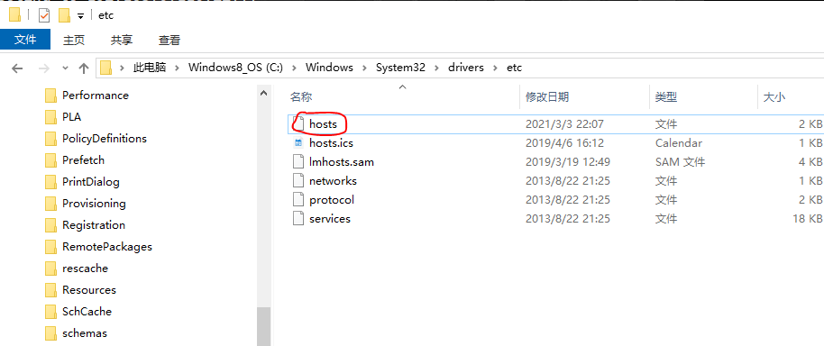
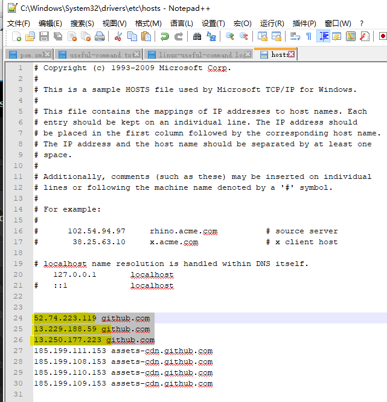
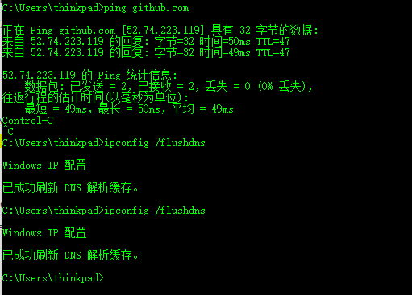

&nbsp;&nbsp;由于日常工作经常需要访问github.com，但是也不知道什么原因，老是出现无法访问的情况,是由于国内的DNS服务器还是墙的问题。

## 解决方法如下

1. 使用ip查询工具，找出github的正确ip地址。

例如： [Ipchaxun](https://ipchaxun.com/)

可以看到解析出来的址。

2. 修改windows的host配置文件，win10配置文件的位置在`C:\Windows\System32\drivers\etc`，其他windows版本位置应该类似。

使用文本工具编辑`host`文件，添加以下内容。
```
52.74.223.119 github.com
13.229.188.59 github.com
13.250.177.223 github.com
```


3. 修改完成后，刷新DNS缓存,使用CMD打开命令行窗口，输入以下命令
```bash
ipconfig /flushdns
```

4. 重新启动浏览器，即可正常访问github了。


操作截图如下: 






