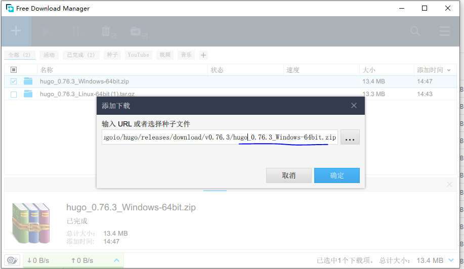

## 什么是Hugo

引用一下[Hugo](https://gohugo.io/)官网的描述

 The world’s fastest framework for building websites  
Hugo is one of the most popular open-source static site generators. With its amazing speed and flexibility, Hugo makes building websites fun again.

 Hugo 是一个非常受欢迎的开源的静态网站生成工具，速度快并且扩展性强，[Hugo github](https://github.com/gohugoio/hugo)目前为止已经有超过4.5W个Star。

## Hugo的安装和使用

Hugo 的[quick-start](https://gohugo.io/getting-started/quick-start/)页面介绍了在各种平台下安装的步骤，Hugo 不用依赖一大堆东西，一个二进制文件就可以搞定，在这里推荐大家下载二进制package安装。

### Mac平台下
Mac平台使用homebrew安装，非常简便。

```bash
brew install hugo
```

### Windows 平台
Windows 下可以使用windows自带的Chocolatey安装，命令如下：
```dos
choco install hugo -confirm
```

请注意使用管理员权限打开cmd. 

### Linux 平台 CentOS/Red Hat 
- 通过源代码的方式安装
- 在Hugo github的 [release page](https://github.com/gohugoio/hugo/releases), 选择Linux-64bit 二进制包，解压然后添加环境变量即可使用。

### Debian 和 Ubuntu 平台
执行如下安装命令。
```bash
sudo apt-get install hugo
```

### Hugo安装过程中遇到的问题

- 笔者在安装过程中，发现国内访问github速度非常缓慢，安装过程中几次都由于网络连接异常而失败，于是后来使用"Free Download Manager", 添加下载任务时，填入github相应的release package的URL，终于下载成功。

*Free Download Manager* 非常好用，在这里推荐一下。

- 在windows 安装过程中，好像只能添加到系统环境变量下才能生效，用户环境变量一直有问题，目前不知是系统问题什么。
  
- Linux 下安装相关命令 仅供参考
    ```bash
    ## 
    [jack@~]$ ls
    download  maven-repsitory  project  runtime
    [jack@~]$ mkdir -p runtime/hugo-engine
    [jack@~]$ ll runtime
    total 0
    drwxr-xr-x 10 root root 272 Nov  1  2019 go
    drwxrwxr-x  2 jack jack   6 Oct 17 16:12 hugo-engine
    [jack@~]$ cd download/  
    [jack@download]$ ll
    total 130872
    -rw-rw-r-- 1 jack jack 120054682 Nov  1  2019 go1.13.4.linux-amd64.tar.gz
    -rw-rw-r-- 1 jack jack  13953412 Oct  9 01:19 hugo_0.76.3_Linux-64bit.tar.gz
    ## 解压到指定目录
    [jack@download]$ tar -zxvf hugo_0.76.3_Linux-64bit.tar.gz -C ~/runtime/hugo-engine/
    LICENSE
    README.md
    hugo
    [jack@download]$ ls
    go1.13.4.linux-amd64.tar.gz  hugo_0.76.3_Linux-64bit.tar.gz
    [jack@download]$ ll ../runtime/hugo-engine/
    total 44904
    -rwxr-xr-x 1 jack jack 45953024 Oct  9 01:11 hugo
    -rw-r--r-- 1 jack jack    11357 Oct  9 01:01 LICENSE
    -rw-r--r-- 1 jack jack    12337 Oct  9 01:01 README.md
    ### 修改环境变量
    [jack@download]$ vi ~/.bashrc

    ### 在~/.bashrc文件最后添加下面3行
    export HUGO_HOME=~/runtime/hugo-engine
    PATH=$PATH:${HUGO_HOME}
    export PATH

    ### 使环境变量生效
    [jack@download]$ source ~/.bashrc
    [jack@download]$ hugo version
    Hugo Static Site Generator v0.76.3-E9623459 linux/amd64 BuildDate: 2020-10-08T17:10:58Z
    [jack@download]$ 

    ```


### 验证安装

安装完成后，打开终端，输入如下命令进行验证是否安装成功。

```bash
hugo version
```
如果没问题的话，会输出Hugo的版本信息。

## 创建第一个站点

使用hugo创建站点非常简单，几个简单的命令就能搞定一个小网站。

### 使用hugo命令初始化站点
大致使用过程如下：

1. 在cmd中将路径切换至要放置博客的主目录，然后执行hugo new site blog。这时会生成blog文件夹，并生产需要的文件及子文件夹
2. 切换到blog下的theme主题目录，然后从hugo的github主题中选择一个。使用git命令git clone 主题git地址下载下来
3. 在config.toml里面配置相关的主题
4. 仔细阅读主题的说明文档，其中写明了主题的使用方法。不同主题的使用方法不同，这里不说明。
5. 写第一篇blog并启动web 
6. 打开浏览器，输入http://localhost:1313查看我们新创建的站点了。

命令参考 
```bash
## 
$ hugo new site blog
$ git init 
$ git submodule add https://github.com/budparr/gohugo-theme-ananke.git themes/ananke
$ echo 'theme = "ananke"' >> config.toml
$ hugo new posts/my-first-post.md
$ vi content/posts/my-first-post.md
$ hugo server -D

```

这里编辑my-first-post.md的时候，文档的头部是关键的描述文件，例如默认的文档会有3个属性，Title 对应html的标题，date是文档的生成时间，draft是用来标记文档状态，注意hugo server 默认启动的时候是不会渲染draft状态的markdown文档，发布的时候一定把他改为false。

更新内容，重新发布
```markdown
---
title: "My First Post"
date: 2020-10-17T18:03:33-04:00
draft: true
---
```

```markdown
---
title: "My First Post"
date: 2020-10-17T18:03:33-04:00
draft: false
---


### Test my first hugo blog, amazing

hahahaha

```

### hugo 的目录结构
我们执行hugo new site xxx 命令的时候，hugo就会自动帮我们生成以下的目录结构，其中config.toml是核心的配置文件。

```text
blog
├── archetypes
├── config.toml
├── content
├── data
├── layouts
├── static
├── themes
└── public
```

+ archetypes

在通过hugo new xxx 创建内容页面的时候，默认情况下hugo会创建date、title等front matter，可以通过在archetypes目录下创建文件，设置自定义的front matter。

+ config.toml

所有的hugo站点都有一个全局配置文件，用来配置整个站点的信息，hugo默认提供了跟多配置指令。

+ content

站点下所有的内容页面，也就是我们创建的md文件都在这个content目录下面。

+ data

data目录用来存储网站用到一些配置、数据文件。文件类型可以是yaml|toml|json等格式。

+ layouts

存放用来渲染content目录下面内容的模版文件，模版.html格式结尾，layouts可以同时存储在项目目录和themes/<THEME>/layouts目录下。

+ static

用来存储图片、css、js等静态资源文件。

+ themes

用来存储主题，主题可以方便的帮助我们快速建立站点，也可以方便的切换网站的风格样式。

+ public

hugo编译后生成网站的所有文件都存储在这里面，把这个目录放到任意web服务器就可以发布网站成功。

### 

### 主题推荐

#### [maupassant-hugo](https://github.com/flysnow-org/maupassant-hugo)
主题预览:  [飞雪无情的博客](http://www.flysnow.org/)  
   
一款非常简洁、性能高的Hugo主题，适配不同的设备（PC，Mobile等）。 主要是基于 Typecho Cho, 从 JokerQyou forked，修改和添加了很多功能而成，如GA统计、最近的文章、标签云、自定义菜单、按日期归档等 .

----


## 参考
- [Hugo中文文档](https://www.gohugo.org/)
- [Hugo](https://gohugo.io/)
- [Github Hugo](https://github.com/gohugoio/hugo)
- [从Hexo迁移到Hugo-送漂亮的Hugo Theme主题](https://segmentfault.com/a/1190000016679032)