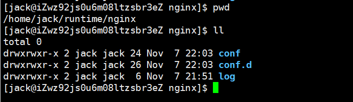
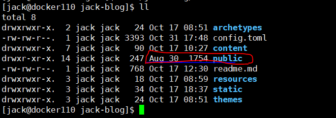
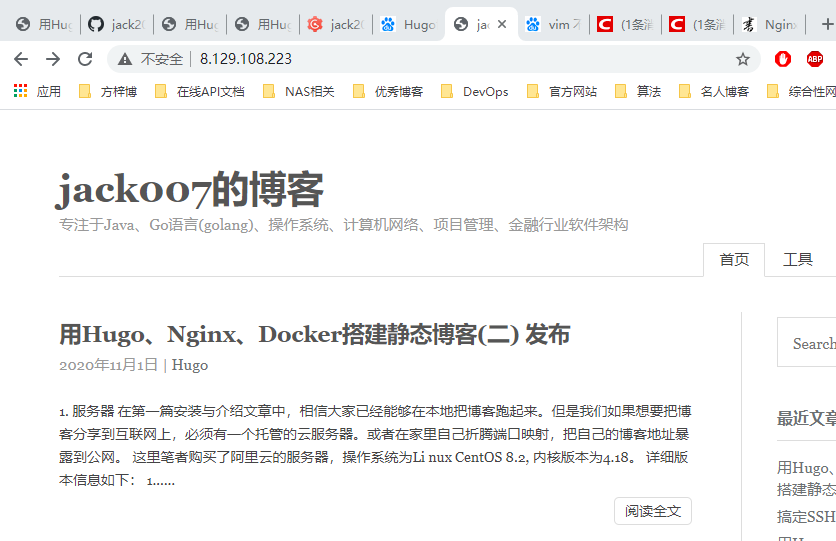

## 1. 服务器

在第一篇安装与介绍文章中，相信大家已经能够在本地把博客跑起来。但是我们如果想要把博客分享到互联网上，必须有一个托管的云服务器。或者在家里自己折腾端口映射，把自己的博客地址暴露到公网。

这里笔者购买了阿里云的服务器，操作系统为Li nux CentOS 8.2, 内核版本为4.18。 详细版本信息如下： 

```bash 
[jack@ ~]$ cat /etc/centos-release
CentOS Linux release 8.2.2004 (Core) 
[jack@ ~]$ 
[jack@ ~]$ uname -a
Linux 4.18.0-193.14.2.el8_2.x86_64 #1 SMP Sun Jul 26 03:54:29 UTC 2020 x86_64 x86_64 x86_64 GNU/Linux
[jack@ ~]$

```

## 2. 软件安装

### git 
怎么安装git,请大家参考git官网，网上资料很多，这里就不在赘述。 例如这里： [如何在centos 8上安装git ](https://blog.csdn.net/cukw6666/article/details/107983303)

### docker 
网上安装教程较多，这里省略。例如这里： [centos8 安装docker](https://www.cnblogs.com/zbseoag/p/11736006.html)

### hugo
安装请参考第一篇的内容。 

## 3. 验证安装

软件安装完成后，查看版本信息。
```bash 
[jack@ jack-blog]$ docker version
Client: Docker Engine - Community
 Version:           19.03.13
 API version:       1.40
 Go version:        go1.13.15
 Git commit:        4484c46d9d
 Built:             Wed Sep 16 17:02:36 2020
 OS/Arch:           linux/amd64
 Experimental:      false

Server: Docker Engine - Community
 Engine:
  Version:          19.03.13
  API version:      1.40 (minimum version 1.12)
  Go version:       go1.13.15
  Git commit:       4484c46d9d
  Built:            Wed Sep 16 17:01:11 2020
  OS/Arch:          linux/amd64
  Experimental:     false
 containerd:
  Version:          1.3.7
  GitCommit:        8fba4e9a7d01810a393d5d25a3621dc101981175
 runc:
  Version:          1.0.0-rc10
  GitCommit:        dc9208a3303feef5b3839f4323d9beb36df0a9dd
 docker-init:
  Version:          0.18.0
  GitCommit:        fec3683
[jack@ jack-blog]$ git -version
unknown option: -version
usage: git [--version] [--help] [-C <path>] [-c <name>=<value>]
           [--exec-path[=<path>]] [--html-path] [--man-path] [--info-path]
           [-p | --paginate | -P | --no-pager] [--no-replace-objects] [--bare]
           [--git-dir=<path>] [--work-tree=<path>] [--namespace=<name>]
           <command> [<args>]
[jack@ jack-blog]$ git --version
git version 2.18.4
[jack@ jack-blog]$ hugo version
Hugo Static Site Generator v0.76.3-E9623459 linux/amd64 BuildDate: 2020-10-08T17:10:58Z
[jack@ jack-blog]$ 
```

## 4. 使用github 管理博客
在第一篇博客中，我们已经使用git 管理起来了博客的相关文件，这里只需要把blog push到github上，然后在服务器中从github中拉下来就能实现博客的动态发布。
登录[github](https://github.com/)， 手动创建一个仓库， 然后从命令行推送已经创建的仓库
```bash
thinkpad@Lenovo-PC MINGW64 /d/jack-blog-github (main)
$ git remote add origin https://github.com/jack20170608/jack-blog-github.git
$ git push -u origin master

## 查看远程仓库已经添加成功
thinkpad@Lenovo-PC MINGW64 /d/jack-blog-github (main)
$ git remote -v
origin  https://github.com/jack20170608/jack-blog-github.git (fetch)
origin  https://github.com/jack20170608/jack-blog-github.git (push)

```

然后在服务器中clone博客，并使用hugo命令测试blog能否编译成功。

```bash 
[jack@ jack-blog]$ git pull 
remote: Enumerating objects: 19, done.
remote: Counting objects: 100% (19/19), done.
remote: Compressing objects: 100% (6/6), done.
remote: Total 10 (delta 4), reused 10 (delta 4), pack-reused 0
Unpacking objects: 100% (10/10), done.
From github.com:jack20170608/jack-blog
   590b259..437bf78  main       -> origin/main
Updating 590b259..437bf78
Fast-forward
 content/post/hugo/hugo-in-action-01/index.md |  5 +++--
 content/post/tool/ssh-usage/index.md         | 16 ++++++++--------
 2 files changed, 11 insertions(+), 10 deletions(-)
[jack@iZwz92js0u6m08ltzsbr3eZ jack-blog]$ hugo
Start building sites … 

                   | EN  
-------------------+-----
  Pages            | 30  
  Paginator pages  |  0  
  Non-page files   |  4  
  Static files     |  7  
  Processed images |  0  
  Aliases          |  9  
  Sitemaps         |  1  
  Cleaned          |  0  

Total in 102 ms
[jack@iZwz92js0u6m08ltzsbr3eZ jack-blog]$ 
```

## 5. 使用Docker的Nginx镜像提供http服务

### 5.1  安装nginx 官方镜像
```bash
[jack@ jack-blog]$ docker pull nginx
[jack@ jack-blog]$ docker images
REPOSITORY          TAG                 IMAGE ID            CREATED             SIZE
nginx               latest              992e3b7be046        4 weeks ago         133MB
[jack@ jack-blog]$ docker ps -a
CONTAINER ID        IMAGE               COMMAND             CREATED             STATUS              PORTS               NAMES
[jack@ jack-blog]$ 
```
### 5.2   验证并启动nginx镜像，映射宿主端口 80 端口到 nginx 的 80 端口
```bash
[jack@jack-blog]$ docker run --name nginx-test -p 80:80 -d nginx
f31f6ff15d4a5c5c0b8d1b9d97819dbb94d035713c9fea9713f361088548727a
[jack@jack-blog]$ docker ps -a
CONTAINER ID        IMAGE               COMMAND                  CREATED             STATUS              PORTS                  NAMES
f31f6ff15d4a        nginx               "/docker-entrypoint.…"   12 seconds ago      Up 11 seconds       0.0.0.0:80->80/tcp   nginx-test

## 使用curl 验证nginx 服务已经启动
[jack@jack-blog]$ curl localhost
<!DOCTYPE html>
<html>
<head>
<title>Welcome to nginx!</title>
<style>
    body {
        width: 35em;
        margin: 0 auto;
        font-family: Tahoma, Verdana, Arial, sans-serif;
    }
</style>
</head>
<body>
<h1>Welcome to nginx!</h1>
<p>If you see this page, the nginx web server is successfully installed and
working. Further configuration is required.</p>

<p>For online documentation and support please refer to
<a href="http://nginx.org/">nginx.org</a>.<br/>
Commercial support is available at
<a href="http://nginx.com/">nginx.com</a>.</p>

<p><em>Thank you for using nginx.</em></p>
</body>
</html>
[jack@jack-blog]$
```

### 5.3 挂载Nginx镜像

Nginx 镜像配置信息在容器中的位置如下： 

日志位置：/var/log/nginx/

配置文件位置：/etc/nginx/

项目位置：/usr/share/nginx/html

**Step1** 创建nginx 挂载目录，并创建配置文件
```bash
[jack@ runtime]$ mkdir -p ~/runtime/nginx/log
[jack@ runtime]$ mkdir -p ~/runtime/nginx/conf
[jack@ runtime]$ touch ~/runtime/nginx/conf/nginx.conf
[jack@ runtime]$ mkdir -p ~/runtime/nginx/conf.d
[jack@ runtime]$ touch ~/runtime/nginx/conf.d/default.conf
[jack@ runtime]$ 

[jack@docker110 conf]$ vi nginx.conf 
```
编辑```~/runtime/nginx/conf/nginx.conf```并输入以下配置信息


```text
user  nginx;
worker_processes  1;  

error_log  /var/log/nginx/error.log warn;
pid        /var/run/nginx.pid;


events {
    worker_connections  1024;
}


http {
    include       /etc/nginx/mime.types;
    default_type  application/octet-stream;

    log_format  main  '$remote_addr - $remote_user [$time_local] "$request" '
                    '$status $body_bytes_sent "$http_referer" '
                    '"$http_user_agent" "$http_x_forwarded_for"';

    access_log  /var/log/nginx/access.log  main;

    sendfile        on; 
    #tcp_nopush     on; 

    keepalive_timeout  65; 

    #gzip  on; 

    include /etc/nginx/conf.d/*.conf;
}

```
编辑 ```~/runtime/nginx/conf.d/default.conf```

```text

server {
    listen       80; 
    server_name  localhost;

    #charset koi8-r;
    #access_log  /var/log/nginx/host.access.log  main;

    location / { 
        root   /usr/share/nginx/html;
        index  index.html index.htm;
    }   

    #error_page  404              /404.html;

    # redirect server error pages to the static page /50x.html
    #   
    error_page   500 502 503 504  /50x.html;
    location = /50x.html {
        root   /usr/share/nginx/html;
    }   

}

```
准备好了之后的目录结构，如下：



### 5.4 建立软连接，并启动nginx 镜像
由于Hugo默认编译会把blog的webRoot为在blog源码的下一级目录public，所以为了方便管理，这里在nginx目录下创建一个软连接，指向blog的public 目录。

这是public 目录的默认位置。


```bash
[jack@iZwz92js0u6m08ltzsbr3eZ nginx]$ ln -s ~/jack-blog/public ~/runtime/nginx/html
[jack@iZwz92js0u6m08ltzsbr3eZ nginx]$ ll
total 0
drwxrwxr-x 2 jack jack 24 Nov  7 22:03 conf
drwxrwxr-x 2 jack jack 26 Nov  7 22:03 conf.d
lrwxrwxrwx 1 jack jack 27 Nov  7 22:13 html -> /home/jack/jack-blog/public
drwxrwxr-x 2 jack jack  6 Nov  7 21:51 log
[jack@iZwz92js0u6m08ltzsbr3eZ nginx]$ 

```

启动nginx镜像，并绑定数据卷。
```bash
[jack@nginx]$ docker run --name jack-blog -d -p 80:80  -v /home/jack/runtime/nginx/log:/var/log/nginx  -v /home/jack/runtime/nginx/conf/nginx.conf:/etc/nginx/nginx.conf -v /home/jack/runtime/nginx/conf.d:/etc/nginx/conf.d -v /home/jack/runtime/nginx/html:/usr/share/nginx/html nginx
9e19a3f46f6dcced6d04faa2f02c93714750e827d9094361370e87a7d5efafde
[jack@nginx]$ docker ps -a
CONTAINER ID        IMAGE               COMMAND                  CREATED              STATUS                          PORTS               NAMES
9e19a3f46f6d        nginx               "/docker-entrypoint.…"   About a minute ago   Exited (1) About a minute ago                       jack-blog
[jack@iZwz92js0u6m08ltzsbr3eZ nginx]$ 
```

### 5.5 访问blog，验证是否启动成功。


## 6. 搞定博客的icon
一般情况下，不同的hugo主题的icon 的设置可能不一样，支持的icon图片格式(ico、svg等等)，文件位置可能不一样。这时只用检查public文件夹下的```index.html```，看icon指向的文件的位置。
例如笔者当前的主题并没有icon相关的设置，于是查看文件发现了这行，文件名根目录下的favicon.ico。
```html
 <link rel="shortcut icon" href='/favicon.ico'  type="image/x-icon">
```
根据hugo的目录结构，于是把favicon.icon放在在```jack-blog/static/``目录下，重新生成即可。

这里推荐一个在线格式转换的网站，可以在线把svg格式的图片转成ico。 [svg-to-ico](https://www.aconvert.com/cn/icon/svg-to-ico/)


## 参考

[Nginx 容器教程](http://www.ruanyifeng.com/blog/2018/02/nginx-docker.html)