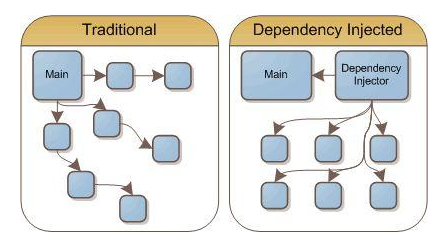

注意：这篇文章主要翻译自guice的github [guice-Motivation](https://github.com/google/guice/wiki/Motivation)

## 开发动机

&emsp;&emsp;在软件开发过程中，把所有东西都连接在一起是非常乏味的部分。当然在java中,有好几种方法可以将诸如：数据，服务处理类以及用于展现的类彼此关联起来。为了对比这些方法，我们将以比萨店订购网站中的支付代码为例来说明。

&emsp;&emsp;例如有一个支付接口，接口的参数为一个订单和一个信用卡,接口返回支付的结果信息。
```java
public interface BillingService {

  /**
   * Attempts to charge the order to the credit card. Both successful and
   * failed transactions will be recorded.
   *
   * @return a receipt of the transaction. If the charge was successful, the
   *      receipt will be successful. Otherwise, the receipt will contain a
   *      decline note describing why the charge failed.
   */
  Receipt chargeOrder(PizzaOrder order, CreditCard creditCard);
}
```
&emsp;&emsp;在实现这个功能的同时, 我们也要编写单元测试的代码。在单元测试中，由于不能用真实的信用卡，实际使用中用模拟的类来替换。假如在当前的支付服务中，我们需要使用`CreditCardProcessor`和`TransactionLog`这2个服务来分别处理。

## 直接调用构造方法
&emsp;&emsp;下面这段代码是直接在BillingService方法里，使用new方法创建credit card processor和transaction logger实例：
```java 
public class RealBillingService implements BillingService {
    public Receipt chargeOrder(PizzaOrder order, CreditCard creditCard) {
        CreditCardProcessor processor = new PaypalCreditCardProcessor();
        TransactionLog transactionLog = new DatabaseTransactionLog();

        try {
            ChargeResult result = processor.charge(creditCard, order.getAmount());
            transactionLog.logChargeResult(result);

            return result.wasSuccessful()
                ? Receipt.forSuccessfulCharge(order.getAmount())
                : Receipt.forDeclinedCharge(result.getDeclineMessage());
        } catch (UnreachableException e) {
            transactionLog.logConnectException(e);
            return Receipt.forSystemFailure(e.getMessage());
        }
    }
}
```
&emsp;&emsp;很明显，这段代码没有实现模块化，而且单元测试很不方便。这种直接的，代码依赖在编译时就已经确定下来的方式，单元测试就会直接在信用卡上扣费，而且如果扣费服务不可用时单元测试就无法正常运行。

## 工厂模式

&emsp;&emsp;工厂类能够解耦接口的调用者与接口的实现类。最简单的就是使用静态工厂方法来get和set模拟的接口实现类。下面就是一个很简单的样版代码。

```java
public class CreditCardProcessorFactory {

    private static CreditCardProcessor instance;

    public static void setInstance(CreditCardProcessor processor) {
        instance = processor;
    }

    public static CreditCardProcessor getInstance() {
        if (instance == null) {
        return new SquareCreditCardProcessor();
        }

        return instance;
    }
}
```
&emsp;&emsp;在客户端代码中，把直接的new 构造方法替换为静态工厂方法。
```java
public class RealBillingService implements BillingService {
  public Receipt chargeOrder(PizzaOrder order, CreditCard creditCard) {
    CreditCardProcessor processor = CreditCardProcessorFactory.getInstance();
    TransactionLog transactionLog = TransactionLogFactory.getInstance();

    try {
        ChargeResult result = processor.charge(creditCard, order.getAmount());
        transactionLog.logChargeResult(result);

        return result.wasSuccessful()
            ? Receipt.forSuccessfulCharge(order.getAmount())
            : Receipt.forDeclinedCharge(result.getDeclineMessage());
        } catch (UnreachableException e) {
        transactionLog.logConnectException(e);
        return Receipt.forSystemFailure(e.getMessage());
    }
  }
}
```
&emsp;&emsp;使用工厂方法的话，写一个合适的单元测试是非常容易的。
```java
public class RealBillingServiceTest {

    private final PizzaOrder order = new PizzaOrder(100);
    private final CreditCard creditCard = new CreditCard("1234", 11, 2010);

    private final InMemoryTransactionLog transactionLog = new InMemoryTransactionLog();
    private final FakeCreditCardProcessor processor = new FakeCreditCardProcessor();

    @Before
    public void setUp() {
        TransactionLogFactory.setInstance(transactionLog);
        CreditCardProcessorFactory.setInstance(processor);
    }

    @After
    public void tearDown() {
        TransactionLogFactory.setInstance(null);
        CreditCardProcessorFactory.setInstance(null);
    }

    @Test
    public void testSuccessfulCharge() {
        RealBillingService billingService = new RealBillingService();
        Receipt receipt = billingService.chargeOrder(order, creditCard);

        assertTrue(receipt.hasSuccessfulCharge());
        assertEquals(100, receipt.getAmountOfCharge());
        assertEquals(creditCard, processor.getCardOfOnlyCharge());
        assertEquals(100, processor.getAmountOfOnlyCharge());
        assertTrue(transactionLog.wasSuccessLogged());
    }
}
```

&emsp;&emsp;这种方法显得非常笨拙，一个全局静态变量保存模拟的instance，所以我们需要小心使用它。如果单元测试执行失败，tearDown没有执行，那么全局变量将继续指向我们的测试实例。这个时候可能会对其他的单元测试造成影响，这也导致单元测试无法并行的执行。

&emsp;&emsp;但是这种方法最大的问题是将类之间的依赖关系隐藏在代码内部，如果我们增加一个依赖例如`CreditCardFraudTracker`, 我们必须重新执行单元测试来发现到底是哪里有问题。 还有一个不好的地方就是我们可能无法及时的发现工厂里的实现类并没有初始化，直到发生方法调用。随着应用程序的增长，保姆工厂的方式对生产力的消耗将越来越大。

## 依赖注入



&emsp;&emsp;类似于工厂模式，依赖注入也是另外一种设计模式。它的核心理念就是将行为和依赖的解析分离开来，简单理解为类的调用者不用关心依赖的类的示例是怎么来的。在下面的这个示例中，`RealBillingService`不负责怎么找`TransactionLog`和`CreditCardProcessor`, 它们是通过构造函数参数的传递进去。

```java
public class RealBillingService implements BillingService {
    private final CreditCardProcessor processor;
    private final TransactionLog transactionLog;

    public RealBillingService(CreditCardProcessor processor,
        TransactionLog transactionLog) {
        this.processor = processor;
        this.transactionLog = transactionLog;
    }

    public Receipt chargeOrder(PizzaOrder order, CreditCard creditCard) {
        try {
        ChargeResult result = processor.charge(creditCard, order.getAmount());
        transactionLog.logChargeResult(result);

        return result.wasSuccessful()
            ? Receipt.forSuccessfulCharge(order.getAmount())
            : Receipt.forDeclinedCharge(result.getDeclineMessage());
        } catch (UnreachableException e) {
        transactionLog.logConnectException(e);
        return Receipt.forSystemFailure(e.getMessage());
        }
    }
}
```

&emsp;&emsp;使用依赖注入，我们不需要任何工厂类，而且我们能简化单元测试代码。
```java
public class RealBillingServiceTest {

    private final PizzaOrder order = new PizzaOrder(100);
    private final CreditCard creditCard = new CreditCard("1234", 11, 2010);

    private final InMemoryTransactionLog transactionLog = new InMemoryTransactionLog();
    private final FakeCreditCardProcessor processor = new FakeCreditCardProcessor();

    @Test
    public void testSuccessfulCharge() {
        RealBillingService billingService
            = new RealBillingService(processor, transactionLog);
        Receipt receipt = billingService.chargeOrder(order, creditCard);

        assertTrue(receipt.hasSuccessfulCharge());
        assertEquals(100, receipt.getAmountOfCharge());
        assertEquals(creditCard, processor.getCardOfOnlyCharge());
        assertEquals(100, processor.getAmountOfOnlyCharge());
        assertTrue(transactionLog.wasSuccessLogged());
    }
}
```

&emsp;&emsp;现在，无论我们要增加或者减少依赖，编译器将提示我们单元测试必须要fix。因为依赖会通过API签名的方式暴露出来。
&emsp;&emsp;我们解决了BillingService的依赖注入问题，如果有其他的类要使用BillingService，我们也使用同样的模式。这样就行成了一个依赖的树，基于这样的模式，有一个框架来帮我们实现这部分功能的话是非常有用的，否则我们将要自己递归的实现。

```java
  public static void main(String[] args) {
    CreditCardProcessor processor = new PaypalCreditCardProcessor();
    TransactionLog transactionLog = new DatabaseTransactionLog();
    BillingService billingService
        = new RealBillingService(processor, transactionLog);
    ...
  }
```

## 使用Guice进行依赖注入
&emsp;&emsp;依赖注入模式使得代码更加模块话以及更加容易测试，Guice能够使依赖注入的模式更加容易在代码中实现。在我们这个支付的示例中，我们首先得告诉它如何map接口到他的实现类。这个配置是在Guice module中完成的，任何实现了Module接口的Java类都可以充当这一角色。

```java
public class BillingModule extends AbstractModule {
    @Override
    protected void configure() {
        bind(TransactionLog.class).to(DatabaseTransactionLog.class);
        bind(CreditCardProcessor.class).to(PaypalCreditCardProcessor.class);
        bind(BillingService.class).to(RealBillingService.class);
    }
}
```
&emsp;&emsp;我们在`RealBillingService`的构造方法中添加了`@Inject`注解。Guice将检查这个构造方法，并根据每个构造方法的参数去查找合适的值。
```java
public class RealBillingService implements BillingService {
    private final CreditCardProcessor processor;
    private final TransactionLog transactionLog;

    @Inject
    public RealBillingService(CreditCardProcessor processor,
        TransactionLog transactionLog) {
        this.processor = processor;
        this.transactionLog = transactionLog;
    }

    public Receipt chargeOrder(PizzaOrder order, CreditCard creditCard) {
        try {
        ChargeResult result = processor.charge(creditCard, order.getAmount());
        transactionLog.logChargeResult(result);

        return result.wasSuccessful()
            ? Receipt.forSuccessfulCharge(order.getAmount())
            : Receipt.forDeclinedCharge(result.getDeclineMessage());
        } catch (UnreachableException e) {
        transactionLog.logConnectException(e);
        return Receipt.forSystemFailure(e.getMessage());
        }
    }
}
```

&emsp;&emsp;最后，我们把他们放在一起，`Injector`注入器类可以用于获取任何绑定类的实例。
```java
  public static void main(String[] args) {
    Injector injector = Guice.createInjector(new BillingModule());
    BillingService billingService = injector.getInstance(BillingService.class);
    ...
  }
```

在快速入门章节中将解释他们是如何运行的。