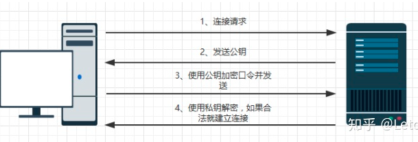
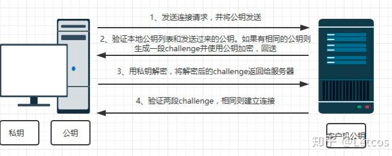

## 1. SSH 密钥登陆原理

### 1.1 对称加密与非对称加密

计算机系统中常见的加密方式有两种，对称加密与非对称加密。对称加密就是信息的发送和接收方使用相同的密钥
，反而言之非对称加密就是使用不同的密钥。

加密方式比较：

| 加密方式   | 优点               | 缺点             | 常见加密算法 |
| ---------- | ------------------ | ---------------- | ------------ |
| 对称加密   | 加密简单，效率很高 | 密钥交换风险高   | DES, AES     |
| 非对称加密 | 安全性更高         | 加密复杂，效率低 | RSA          |


实际在应用中一般的系统都设计了多层的加密体系，简单来说一般使用非对称密钥来加密对称密钥实现密钥交换，然后使用对称密钥来加密传输内容。

### 1.2 RSA 非对称加密
RSA是1977年由罗纳德·李维斯特（Ron Rivest）、阿迪·萨莫尔（Adi Shamir）和伦纳德·阿德曼（Leonard Adleman）一起提出的。当时他们三人都在麻省理工学院工作。RSA就是他们三人姓氏开头字母拼在一起组成的。

 RSA公开密钥密码体制是一种使用不同的加密密钥与解密密钥，“由已知加密密钥推导出解密密钥在计算上是不可行的”密码体制。在公开密钥密码体制中，加密密钥（即公开密钥）PK是公开信息，而解密密钥（即秘密密钥）SK是需要保密的。加密算法E和解密算法D也都是公开的。虽然解密密钥SK是由公开密钥PK决定的，但却不能根据PK计算出SK。 

  1. 乙方生成两把密钥（公钥和私钥）。公钥是公开的，任何人都可以获得，私钥则是保密的。
  2. 甲方获取乙方的公钥，然后用它对信息加密。
  3. 乙方得到加密后的信息，用私钥解密。

如果公钥加密的信息只有私钥解得开，那么只要私钥不泄漏，通信就是安全的。

### 2. SSH 的两种登录方式
- 用户名+ 密码 

- 密钥验证登录


从这里可以看出，若使用免密登录，必须把client的公钥分发到server的公钥列表中，也就是```~/.ssh/authorized_keys```文件中。

### 3. SSH 免密登录处理步骤
**Step1** : 在需要免密登陆的主机（主机A）下生成公钥和私钥

```bash 
# ssh-keygen -t rsa     ##-t rsa可以省略，默认就是生成rsa类型的密钥
```

说明：命令执行后会有提示，输入三次回车即可，执行完成后会在当前用户的.ssh目录下生成两个文件：id_rsa、id_rsa.pub文件，前者时私钥文件，后者是公钥文件（拷贝到其他主机只需要拷贝这个文件的内容）。

**Step2**  将公钥复制到被登陆的主机上的 ~/.ssh/authorized_keys 文件中
拷贝公钥有两种方法，其原理都相同：

使用 ssh-copy-id 直接拷贝

使用 ssh-copy-id 进行拷贝公钥非常方便，只需要指定目标主机和目标主机的用户即可。

```shell
# ssh-copy-id -i ~/.ssh/id_rsa.pub root@192.168.187.142
```

执行这条命令后会自动将登录主机的公钥文件内容追加至目标主机中指定用户（root）.ssh目录下的authorized_keys文件中。这个过程是全自动的，非常方便。

自己创建文件进行拷贝
1) 在登录主机（客户机）上创建authorized_keys文件并将公钥追加到该文件。
```bash 
# cat id_rsa.pub >> authorized_keys
# chmod 600 authorized_keys     ##修改文件权限为600，该文件有规定如果属组其他人出现可写则文件就不会生效
```
2) 在被登录机的指定用户家目录下创建 .ssh 目录（这里在root用户下创建，因为要使用密钥登陆到root用户）
```bash
# mkdir .ssh
# chmod 700 .ssh     ##将目录权限改为700该目录的权限必须是700才有效
```   
3) 将登录机创建的authorized_keys文件拷贝到被登录机，使用scp
```bash
# scp authorized_keys root@192.168.187.142:/root/.ssh/
authorized_keys  
```
几点注意： 

Linux 不同的用户下都有自己的.ssh 文件夹，用来保存当前用户下的ssh密钥信息, 公钥拷贝的时候一定要指定某个用户。

.ssh 文件夹权限必须为700，这里是为了防止其他用户能够访问该文件夹

authorized_keys文件权限必须为600，该文件有规定如果属组其他人出现可写则文件就不会生效

### 4. 登录
使用主机A乙root用户身份登陆到主机B
```bash 
1 # ssh root@192.168.187.142
2 Last login: Wed Feb 13 15:24:30 2019 from 192.168.187.137
```
首次登录将弹出保存信息，输入yes即可，此时已经实现了免密的密钥登陆。

#### 4.1 无法免密登陆问题

有的时候传送密钥后怎么调试都不行，比如修改chmod 600 id_rsa ,还有 chmod 700 ~/.ssh ，当然这两个是必须的，普通用户没有~/.ssh 需要手动创建就必须修改为700的权限。

#### 4.2 服务器端sshd配置文件
/etc/ssh/sshd_config
```yml
## 还有配置文件添加开启

RSAAuthentication yes
PubkeyAuthentication yes 
AuthorizedKeysFile .ssh/authorized_keys
## 然后重启systemctl restart sshd
```
如果仍然不行,且使用ssh-copy-id -i ~/.ssh/id_rsa.pub root@192.168.10.2有如下提示
```yml 
Number of key(s) added: 1

Now try logging into the machine, with: "ssh 'root@192.168.10.2'"
and check to make sure that only the key(s) you wanted were added.
```
则需要指定密钥路径
```bash
ssh -i ~/.ssh/id_rsa root@192.168.10.2
```
同理scp时也需要指定
```bash
scp -i ~/.ssh/id_rsa root@192.168.10.2:/xxx
```

### 5. 客户端配置
有时候客户端 ssh配置较多，例如要配置端口(非默认22)，使用代理proxy, 使用指定的密钥，为了使连接更简单，使用config文件可以很好的解决这个问题。

config文件配置十分简单，只需要按照以下格式配置即可。

```bash
# 为.ssh目录设置权限
> chmod 600 ~/.ssh/config
```

```text
# config文件需要放到 ~/.ssh/config

Host prod
    HostName 121.0.0.3
	User support
	Port 1022
    IdentityFile ~/.ssh/id_rsa_121

Host uat
    HostName 121.0.0.4
	User root
	Port 2222
```
将config文件放到当前用户home下的.ssh/目录下之后需做如下操作来完成免密码登陆，这样就不需要输入ip,port等信息，非常方便。

```bash
#现在使用如下即可登陆prod（其他主机方法一样）
ssh prod
```

注意本地config的权限也应该设置为600。

### 6. 参考链接

+ [百度百科](https://baike.baidu.com/item/RSA%E7%AE%97%E6%B3%95/263310?fromtitle=RSA&fromid=210678&fr=aladdin)
+ [RSA算法原理](http://www.ruanyifeng.com/blog/2013/06/rsa_algorithm_part_one.html)
+ [对称加密与非对称加密](https://www.jianshu.com/p/d1d35cdd113a)
+ [ssh免密登陆原理-步骤-问题](https://zhuanlan.zhihu.com/p/142900786)